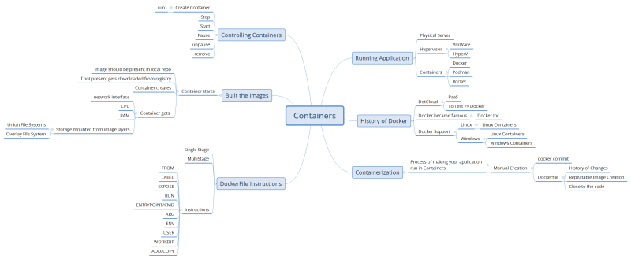

### Application Deployment using Docker

## Java Application Deployment
* First write a Dockerfile

```Dockerfile
FROM amazoncorretto:11
ADD https://springpetclinic-devopseasy.s3.us-west-2.amazonaws.com/spring-petclinic.jar /spring-petclinic.jar
EXPOSE 8080
CMD ["java", "-jar", "/spring-petclinic.jar"]


FROM tomcat:8-jdk8
EXPOSE 8080
ADD https://gameoflife-devopseasy.s3.us-west-2.amazonaws.com/gameoflife.war /usr/local/tomcat/webapps/gameoflife.war
CMD ["catalina.sh", "run"]
```
* Now build this Dockerfile & create image
```
docker image build -t gof:1 .
```
* Now create a docker container

```
docker container run -d -P gof:1
```
## .Net Application Deployment
* First write Dockerfile

```Dockerfile
FROM ubuntu:22.04 as unzip
RUN mkdir /Nop
RUN apt update && \
    apt install wget unzip -y && \
    cd /Nop && \
    wget "https://github.com/nopSolutions/nopCommerce/releases/download/release-4.50.3/nopCommerce_4.50.3_NoSource_linux_x64.zip" &&\
    unzip /Nop/nopCommerce_4.50.3_NoSource_linux_x64.zip && \
    rm /Nop/nopCommerce_4.50.3_NoSource_linux_x64.zip


FROM mcr.microsoft.com/dotnet/aspnet:6.0
LABEL author="devopseasy"
COPY  --from=unzip /Nop /Nop
WORKDIR /Nop
EXPOSE 80
CMD ["dotnet","/Nop/Nop.Web.dll"]
```
* Crete Docker image & Docker container 

## Python Application Deployment
* First write Dockerfile

```Dockerfile
FROM python:3.10-bullseye
LABEL author = "devopseasy"
EXPOSE 5000
RUN git clone https://github.com/Sysnove/flask-hello-world.git && \
    cd flask-hello-world && \
    mv hello.py app.py && \
    pip3 install flask
WORKDIR /flask-hello-world
CMD ["flask", "run", "-h", "0.0.0.0"]

## alpine thin image

FROM python:3-alpine3.10
LABEL author = "devopseasy"
EXPOSE 5000
RUN mkdir /flask-hello-world
ADD . /flask-hello-world
RUN cd flask-hello-world && \
    pip3 install flask
WORKDIR /flask-hello-world
CMD ["flask", "run", "-h", "0.0.0.0"]
```
* Create docker image & run container

## Nodejs with Angular
* write Dockerfife

```Dockerfile
FROM node:16
LABEL project="devopseasy"
LABEL author="docker-devops"
RUN git clone https://github.com/gothinkster/angular-realworld-example-app.git
RUN cd angular-realworld-example-app && npm install -g @angular/cli && npm install
EXPOSE 4200
WORKDIR /angular-realworld-example-app
CMD ["ng", "serve", "--host", "0.0.0.0"]
```
* create docker image & container

## ReactJS Application Deployment
* First create dockerfile
```Dockerfile
FROM node:14
LABEL author=devopseasy
EXPOSE 3000
RUN git clone https://github.com/simonplend/example-app-nodejs-backend-react-frontend.git && \
    cd example-app-nodejs-backend-react-frontend && \
    npm install && \
    npm run build
WORKDIR /example-app-nodejs-backend-react-frontend
CMD ["npm", "start", "--host", "0.0.0.0"]
```
* create docker image and container
* Docker Life Cycle Overview:




