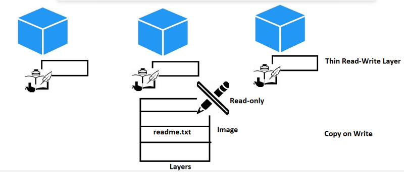
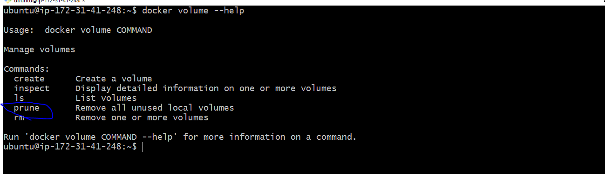
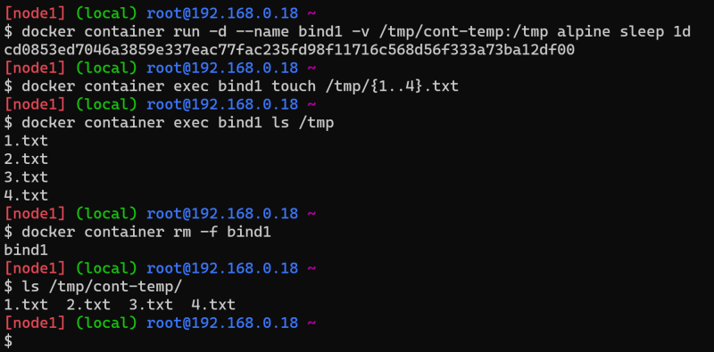
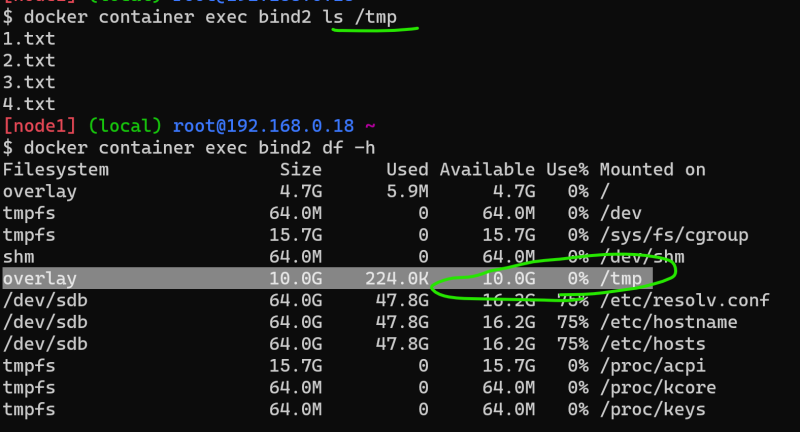
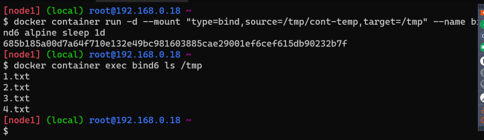
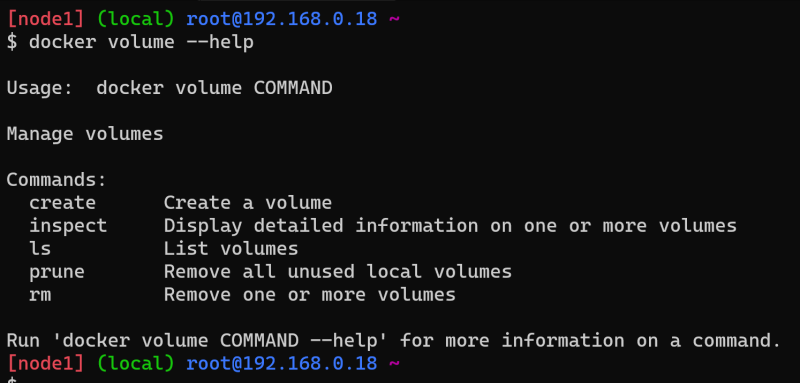
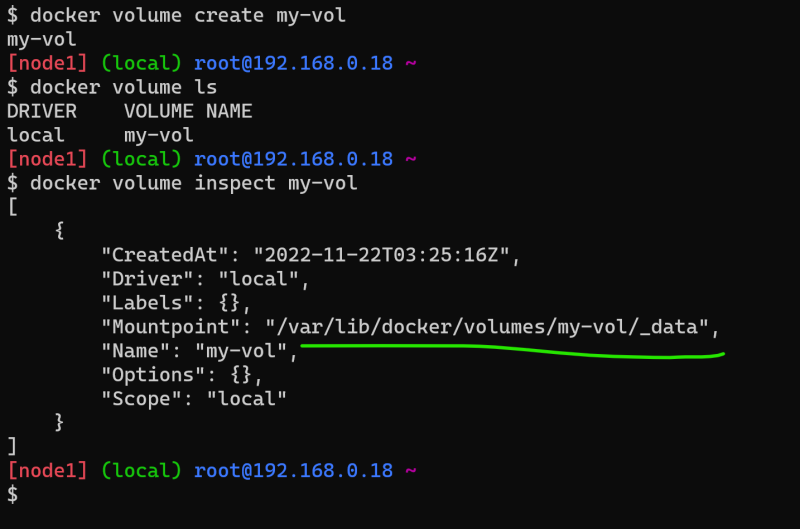
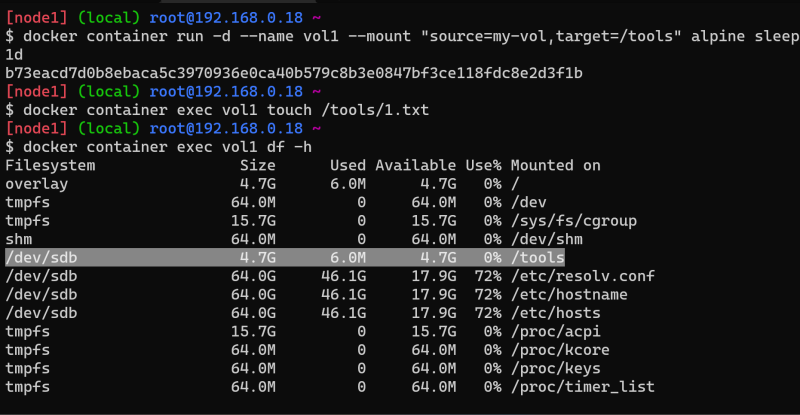
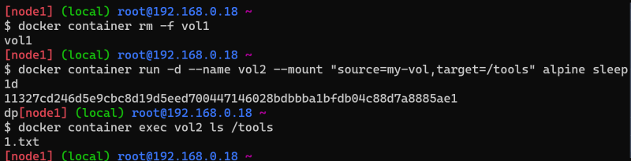

### Problem with Persistence in Containers
* Each Docker container gets an thin read-write layer, where the files generated/modified by application are present.
* Docker container gets a filesystem which is collection of image layers plus read-write layer mounted on each other but it looks like one filesystem.
* When container tries to edit existing files in image layers , this will not impact image layers as image layers are read-only.
* Internally docker storage system copies the files from read-only image layers to thin read-write layer before modification. This strategy is called as ``` Copy-on-write ```



* Docker acheives this functionality with the help of storage drivers.
## Storage Drivers
* Storage Drivers allow you to create the data in the writable layer of the container

* Docker supports the following storage drivers

   * overlay2 :
        * Preferred storage driver for all linux distributions
        * Requires no extra configuration
   * aufs :
        * is the preferred storage driver for Docker 18.06 and older, when running on Ubuntu 14.04 on kernel 3.13 which has no support for overlay2
   * devicemapper :
        * Requires direct-lvm for production environments
        * zero configuration is available but has poor performance
        * devicemapper was the recommended storage driver for CentOS and RHEL, as their kernel version did not support overlay2, However current versions of Centos & RHEL support overlay2 now
   * btrfs:
        * used if the hosts file system is btrfs
        * snapshots are supported
   * zfs:
        * used if the hosts file system is zfs
        * snapshots are supported
* To know your current storage driver, execute “`docker info“ and you should see Section Storage Driver. 

* The lifetime of Read-Write layer is equal to lifetime of container i.e. once the container is deleted all the contents of writable layer are also deleted.
* To solve this problem docker has introduced the concept of Volumes.

## Docker Volumes
* [Refer Here](https://docs.docker.com/storage/volumes/) for the official docs
* Docker volumes purpose is to persist the data even after container is deleted.
* Docker Volume types
    * bind mount
    * Volume
    * tmpfs

* I want to preserve what ever is present in tmp directory of alpine container.
* Bind mount: Mount existing folder from docker host to any folder in container.
    * Create a folder
    * mount it to the container
    * Create some files

    

    

    * Delete the container and cross check the files
    * Now create a new container and mount the files to the same path

    

    * We can also share the same folder from docker host to multiple containers.
    * The same thing can be acheived with –mount
     ``` docker container run -d --mount "type=bind,source=/tmp/cont-temp,target=/tmp" --name bind6 alpine sleep 1d ```

     

* Volume Mounts: These are storage spaces generally from docker host which is managed by docker. docker has a sub command docker volume





* Lets mount the tools folder in alpine container with my-vol



* Delete the container



* To remove the volume execute ``` docker volume rm ```

