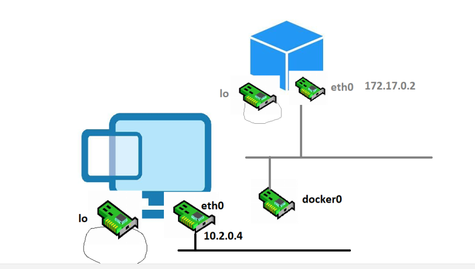
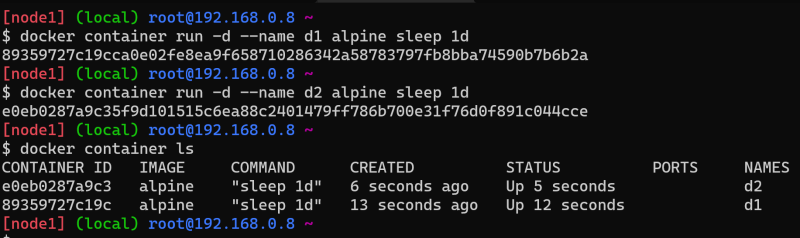

## Networking
* Every container is getting an ip address
* Docker has a subcommand for network


* lets see what are the networks available


* Two possible Networing options identified
* Share the same network of docker host to the container


* Create a new network on the docker host and make it available to the containers. Connect the network created by docker host to the network docker host is connected by using a bridge


* Experiment:
* Created a linux vm and verified network interfaces. we had two interfaces
    * loopback (lo) => 127.0.0.1/localhost
    * eth0
* We had installed docker on the linux machine and one more interface got created
    * docker0
* Now we have create a docker container and verified the network interfaces we got two interfaces
  * loopback (lo)
  * eth0

  

## Experiments
* Lets see the networks available in the docker host

 

* Now lets create two alpine containers d1 and d2

 

* bridge is the default network so lets inspect that

```
docker network inspect bridge
```

* d1 has an ip ``` 172.17.0.2 ``` and d2 has an ip ``` 172.17.0.3 ```
* Lets run ping from d1 to d2 using name and then ip

```
docker exec d1 ping -c 4 d2
```

* In default bridge network we are able to ping containers by its ip address
* Now lets try to create our bridge network ``` my_bridge ```

 ```
 docker network create -d bridge --subnet "10.10.10.0/24" my_bridge
 ```

* Now lets create two containers m1 and m2

```
docker container run -d --name m1 --network my_bridge alpine sleep 1d

docker container run -d --name m2 --network my_bridge alpine sleep 1d
```

* Inspect the bridge network

```
docker network inspect my_bridge
```

* Lets ping from m1 to m2 using name i.e. service discovery using DNS and then by ip

 ```
 docker exec m1 ping -c 4 m2
 ```

* The network which we created is user defined bridge network
* Containers can be disconnected from their original network and connected to new network. In the below example i’m connecting d1 from default brige to my_bridge

```
docker network connect my_bridge d1
docker exec m1 ping -c 4 d1
```

* disconnect can be used to move the container back to its parent network.

