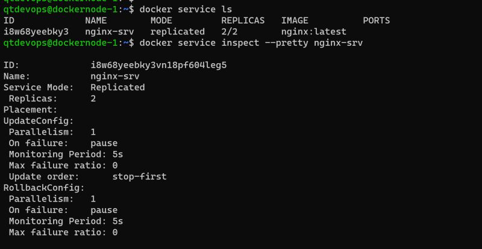
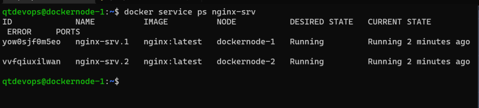

## Multi Host Networking(Docker Swarm)
* Multi-host networking is created as part of docker orchestration called as SWARM
* According to what we have learnt so far. Communication between containers in same host is possible using bridge. But communication between two containers running on two different hosts is not possible


* Docker has a network driver called as overlay network
* Using vxlan, overlay networks use underlay to create a virtual network which is logical and appears as if the containers across hosts are connected to the same network


* To create multi host network, we need to create docker swarm cluster.
* All the nodes should be reachable to each other
* docker should be installed on all the nodes
* Create two linux servers and install docker in it
* Select any linux server and initialize swarm

```
docker swarm init ## execute in master
```
* On the manager two extra docker networks will be created


* Pictorial reprsentation


* Now execute docker swarm join command on the node-2


* Lets look at networks


* Communication from one to other container will look as shown below


* Lets see the list of nodes in docker swarm manager


* Lets create a service of nginx

```
docker service create --replicas 2 --name nginx-srv nginx

```






* We have initialize the swarm cluster and created two services
```
nginx: docker service create --replicas 2 --publish mode=host,target=80,published=8080 nginx
jenkins: docker service create --replicas 2 --publish mode=host,target=8080,published=8081 jenkins/jenkins

```
* To access them we have used 8080 port of any node in cluster


* To access jenkins we have used 8081 port of any node in cluster


## DOCKER CONTAINER RESTRICTIONS, LOGGING ETC
* Run jenkins container

```
docker container run --name jenkins -d -P jenkins/jenkins:latest
## Inspect container: docker container inspect jenkins
## top command: docker container top jenkins
```
* to know the stats resources consumed by containers: ``` docker container stats ```
* to look at logs generated by container on STDOUT, STDERR: ``` docker container logs ```
* Login into running container: ``` docker container exec -it <name> <shell> ```

* Containers can be paused and unpaused: ``` docker container pause jenkins ```

* To stop the container docker container stop and to start it back docker container start
* Lets run the portainer container which shows the information about networks, volumes, images, events about the containers running on a host

```
docker container run -d -p 8000:8000 -p 9443:9443 --name portainer --restart=always -v /var/run/docker.sock:/var/run/docker.sock -v portainer_data:/data portainer/portainer-ce:latest
```
* Run a container with restricted memory:``` docker container run --name jenkins2 --memory 1024m -d -P jenkins/jenkins:latest ```

## Docker-Compose
* Docker compose lets run multiple containers in a Docker and also lets define the necessary volumes and networks
* Hello-world docker compose. Create a file called as docker-compose.yaml

```
services:
  app:
    image: httpd
    ports:
      - "8080:80"
  db:
    image: mysql
```
* now execute docker-compose up -d

```
docker-compose up -d
docker compose ps
docker-compose down
```


