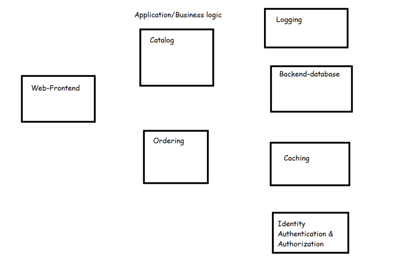
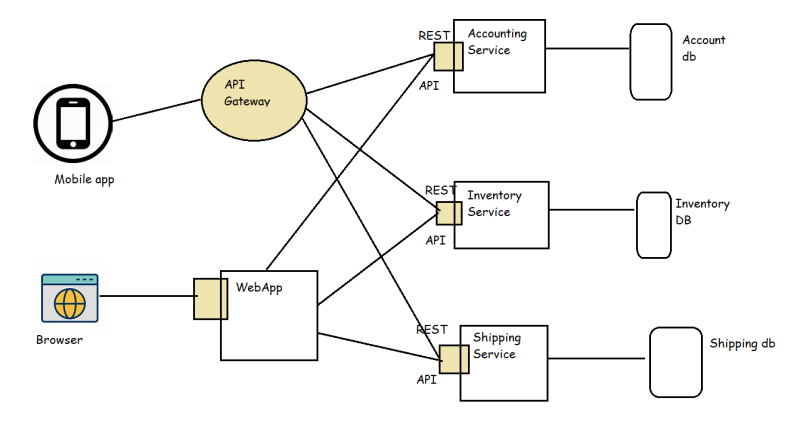

### Docker Compose
* This is a tool for defining an running multi container Docker applications
* All the modern applications will have the some/all of the following components



* When all of these components work together we have a successful application
* Lets understand microservices
* To bringup our application we need to run multiple containers in a specific order.
* Docker compose is one approach to bring up multiple container of your application on a single docker host platform.
* Docker compose is widely used in Developer environments

## Microservices
* This is an architectural pattern that structures and application as a collection of services that are
    * Highly maintable and testable
    * Loosely coupled
    * Independently deployable
    * Organized around business capabilities

* Simple microservice architecture



* Now we can deploy each service in a container/vm Now this gives us the following benifits
    * We can have parallel developments for each service
    * Reusability of services can be done across applications
    * We can scale the individual services when there is load.
* The best way to run individual services is in containers and to manage the whole application deploymets we use orchestration platforms such as
    * Kubernetes
    * Docker Swarm
    * OpenShift

## How to work with Docker compose
* In Docker compose we create a file called docker-compose.yaml and we specify the containers to be created, their network, their volumes as specified in docker compose specifications [Refer Here](https://docs.docker.com/compose/compose-file/)
* In with the code repository docker-compose.yaml is commited to make it easier to bring up multiple containers to run an application

* Building images and running containers

```
version: "3.9"
services:
  gol:
    build: ./gol
    ports:
      - 8080:8080
  spc:
    build: ./spc
    ports:
      - 8081:8080
```
* Execute the commands
```
docker-compose build
docker-compose up -d
docker container ls
docker image ls
```
* Creating a docker-compose file with a network and volume

```
version: "3.9"
services:
  gol:
    build: ./gol
    ports:
      - 8080:8080
    volumes:
      - type: volume
        source: loggol
        target: /var/log
    networks:
      - denetwork
  spc:
    build: ./spc
    ports:
      - 8081:8080
    volumes:
      - type: volume
        source: logspc
        target: /var/log
    networks:
      - denetwork

volumes:
  logspc:
  loggol:
  
networks:
  denetwork:
    driver: bridge
    
```

* Execute-commands

```
docker-compose build
docker-compose up -d
docker container ls
docker image ls
docker volume ls
docker network ls
```