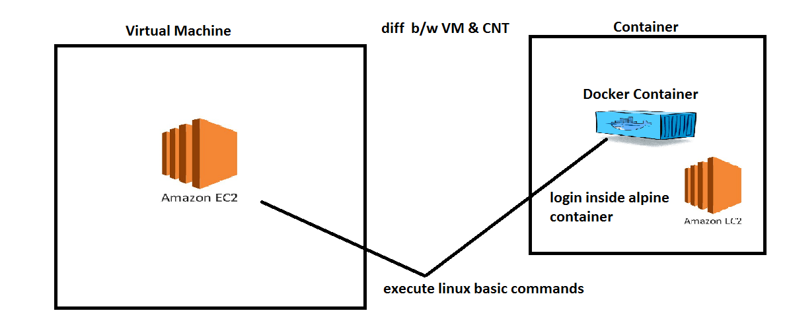
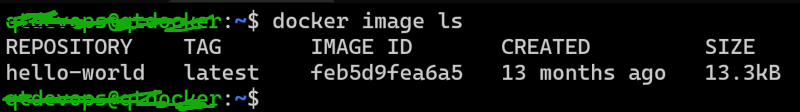
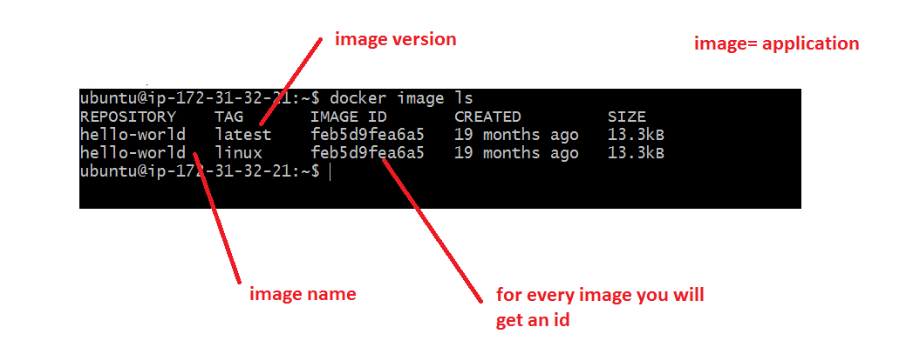
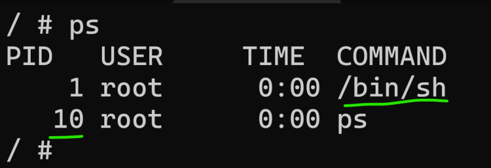
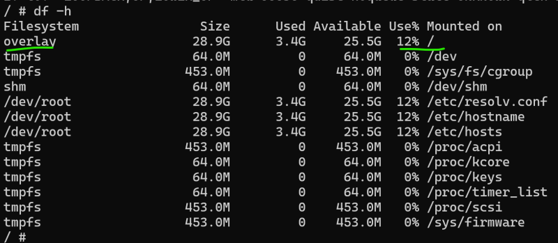

## Image and Tag
* Overview 



* Any docker image represents some application. Every application will have multiple versions.
* In Docker to represent application we use name of image and to represent version we use tag. The convention ``` <image-name>:<tag> ```

```
hello-world => hello-world:latest
```
* If the tag is not passed docker assumes the tag to be latest





* Along with Repository (image name) and tag we also have image-id

## Container Options
* We can perform the following operations
    * Create container
    * Delete container
    * start container
    * stop container
    * pause container
    * unpause container
* Every container when created gets a unique
    * container id
    * container name
* We can set the container name

```
docker container run --help
docker container run --name <cont-name> <image>:<tag>
```
* To see the container running in the docker host ``` docker container ls ```, to see the status of all the containers created by docker host which are not deleted ``` docker container ls --all ```
* When the container is created, each container gets its own
    * network ip address
    * RAM
    * filesystem
    * CPU share
* Execute ``` docker stats ``` to know the cpu/RAM utilization

## Exploring container
* On the docker host execute the folowing commands

    * list all the process ps or ps aux
    * get the ip address ``` ip addr ``` or ``` ifconfig ``` (10.2.0.4)
    * username => devopseasy(``` whoami ```)
    * hostname => docker(``` hostname ```)
    * Explore storage ``` df -h ``` & ``` lsblk ```
* Lets create a container and login into that ``` docker container run -it alpine /bin/sh ```
* Execute the following commands
    * find username and hostname ``` whoami ``` and ``` hostname ``` (root & 03558710c5d9)
    * ip address ``` ip addr ``` (172.17.0.4)
    * examine the running process ``` ps ```
     
     

    * examine disk mounts ``` df -h ```

     

* Based on all of the observations a container looks like a linux machine inside a linux machine i.e virtual machine

* Docker image contains all the necessary files to run whatever application we want inside container.

## Next Steps
* Lets install a java application on a linux machine
* Lets try to also run the same java application inside some container and understand the docker image concept
* Lets create a docker image and also understand its read-only nature.


