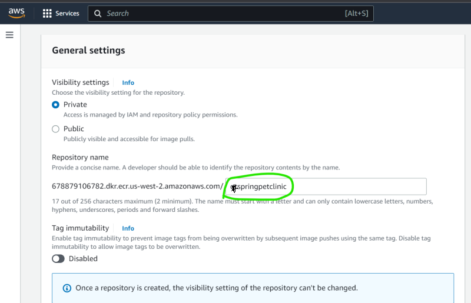

### Multi Stage Docker Build
* Multi staged build is used to build the code and copy necessary files into the final stage which will be your image


* [Refer Here](https://docs.docker.com/build/building/multi-stage/) for official docs

## Scenario – 1: Java Spring petclinic

* To build this application we need
    * jdk11
    * maven
    * git
* Manual steps:

```
git clone https://github.com/spring-projects/spring-petclinic.git
cd spring-petclinic 
mvn package
# a file gets created in target/spring-petclinic-*.jar
```
* To run this application we need jdk 11

```
FROM alpine/git AS vcs
RUN cd / && git clone https://github.com/spring-projects/spring-petclinic.git && \
    pwd && ls /spring-petclinic

FROM maven:3-amazoncorretto-17 AS builder
COPY --from=vcs /spring-petclinic /spring-petclinic
RUN ls /spring-petclinic 
RUN cd /spring-petclinic && mvn package


FROM amazoncorretto:17-alpine-jdk
LABEL author="devopseasy"
EXPOSE 8080
ARG HOME_DIR=/spc
WORKDIR ${HOME_DIR}
COPY --from=builder /spring-petclinic/target/spring-*.jar ${HOME_DIR}/spring-petclinic.jar
EXPOSE 8080
CMD ["java", "-jar", "spring-petclinic.jar"]
```
* For .NET Application

```
FROM ubuntu:22.04 AS extractor
RUN apt update && apt install unzip
ARG DOWNLOAD_URL=https://github.com/nopSolutions/nopCommerce/releases/download/release-4.60.2/nopCommerce_4.60.2_NoSource_linux_x64.zip
ADD ${DOWNLOAD_URL} /nopCommerce/nopCommerce_4.60.2_NoSource_linux_x64.zip
RUN cd /nopCommerce && unzip nopCommerce_4.60.2_NoSource_linux_x64.zip && mkdir bin logs && rm nopCommerce_4.60.2_NoSource_linux_x64.zip


FROM mcr.microsoft.com/dotnet/sdk:7.0
LABEL author="devopseasy" organization="de" project="learning"
ARG user=nopcommerce
ARG group=nopcommerce
ARG uid=1000
ARG gid=1000
ARG DOWNLOAD_URL=https://github.com/nopSolutions/nopCommerce/releases/download/release-4.60.2/nopCommerce_4.60.2_NoSource_linux_x64.zip
ARG HOME_DIR=/nop
RUN apt update && apt install unzip -y
# Create user nopcommerce
RUN groupadd -g ${gid} ${group} \
    && useradd -d "$HOME_DIR" -u ${uid} -g ${gid} -m -s /bin/bash ${user}
USER ${user}
WORKDIR ${HOME_DIR}
COPY --from=extractor  /nopCommerce ${HOME_DIR}
EXPOSE 5000
ENV ASPNETCORE_URLS="http://0.0.0.0:5000"
CMD [ "dotnet", "Nop.Web.dll"]
```

## Scenario -2 Game of life
* code [Refer Here](https://github.com/wakaleo/game-of-life)
* tools:
    * jdk 8
    * git
    * maven
```
FROM alpine/git AS vcs
RUN cd / && git clone https://github.com/wakaleo/game-of-life.git

FROM maven:3-amazoncorretto-8 AS builder
COPY --from=vcs /game-of-life /game-of-life
RUN cd /game-of-life && mvn package

FROM tomcat:9-jdk8
LABEL author="devopseasy" organization="de"
COPY --from=builder /game-of-life/gameoflife-web/target/*.war /usr/local/tomcat/webapps/gameoflife.war
EXPOSE 8080
```

### Pushing images to Registries

## Docker Hub
* Public Registry: Docker Hub [Refer Here](https://hub.docker.com/)
* Create a public Repository
* Repository will be in the form of ``` <username>/<repo-name>:<tag> ```
* After building the image tag the image to new naming format

```
docker image tag spc:3.0.0 <username>/<repo_name>:3.0.0
docker image tag spc:3.0.0 devopseasy/spc:3.0.0
```
* if this image has to be default also tag with latest (optional)

```
docker image tag spc:3.0.0 <username>/<repo_name>:latest
docker image tag spc:3.0.0 devopseasy/spc:latest
```
*  login into docker hub from cli
```
docker login
## enter usename & password
```
* lets push the images

```
docker image push devopseasy/spc:3.0.0
```

### Private Registries
* There are many applciations for hosting private registries
    * AWS: ECR (Elastic container registry)
    * Azure: ACR (Azure Container Registry)
    * Jfrog

## AWS ECR
* Create an ECR Repository





* view push commands


* install and configure aws cli [Refer Here](https://sst.dev/chapters/create-an-iam-user.html)


## Azure ACR

*  [Refer Here](https://learn.microsoft.com/en-us/azure/container-instances/container-instances-tutorial-prepare-acr) for detailed information

* Docker Workflow [Refer Here](https://docs.docker.com/get-started/overview/)

* 
