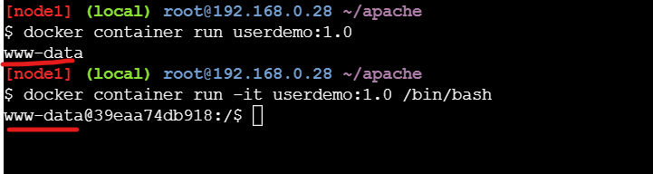
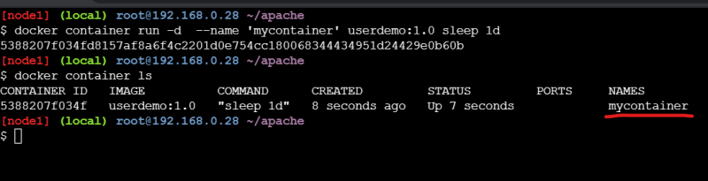
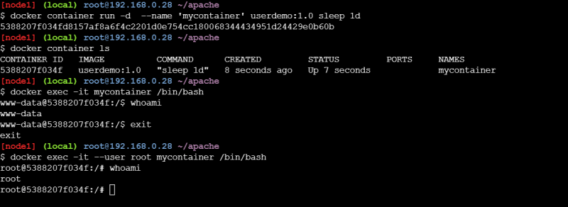

### ENV & ARG Directive/instruction
* The ENV directive is used to set environmental variables. These environmental variables are used by applications to get information Syntax.

```
ENV <key> <value>
```
* ARG instruction is used to define the variables that the user can pass while building the image Syntax

```
ARG <variablename>=<defaultvalue>
```

```
FROM tomcat:8-jdk8
EXPOSE 8080
ARG dl="https://gameoflife-devopseasy.s3.us-west-2.amazonaws.com/gameoflife.war"
ADD  ${dl} /usr/local/tomcat/webapps/gameoflife.war
CMD [ "catalina.sh","run" ]
```
* Now build the image 


* ENV variables will be available in the containers also

```
FROM tomcat:8-jdk8
EXPOSE 8080
ENV ver=1.0
ARG dl="https://gameoflife-devopseasy.s3.us-west-2.amazonaws.com/gameoflife.war"
ADD  ${dl} /usr/local/tomcat/webapps/gameoflife.war
CMD [ "catalina.sh","run" ]

FROM tomcat:8-jdk8
EXPOSE 8080
ENV ver=1.0
ENV location="/usr/local/tomcat/webapps/gameoflife.war"
ARG dl="https://gameoflife-devopseasy.s3.us-west-2.amazonaws.com/gameoflife.war"
ADD  ${dl} ${location}
CMD [ "catalina.sh","run" ]
```
* Now build the docker image


## WORKDIR instruction
* By default if we donot specify the default working directory is /
* Where as in Dockerfile it is possible to change the working directory

```
FROM amazoncorretto:11-alpine-jdk
WORKDIR /etc
ADD https://springpetclinic-devopseasy.s3.us-west-2.amazonaws.com/spring-petclinic.jar /spring-petclinic.jar
EXPOSE 8080
CMD ["java","-jar","/spring-petclinic.jar"]
```
* Now build the docker image


## ADD and COPY instruction
* During the docker image build process we might require to copy files from our local system into docker image filesystem. This can be acheived by using COPY/ADD instruction

```
COPY <source> <destination>
ADD <source> <destination>
```
* In some cases while building docker image you might require to download the files from some urls and copy to the docker file system, then we can use ADD instruction

```
ADD <source> <destination>
```
* Create a sample index.html file for practical implementation

```
<html>
    <body>
        <h1>Welcome to Devops Easy</h1>
    </body>
</html> 
```

* Now create a Dockerfile in same location of index.html file

```
FROM ubuntu:18.04
LABEL author="DevopsEasy"
RUN apt-get update && apt-get install apache2 -y
WORKDIR /var/www/html/
COPY index.html .
CMD ["echo","helloworld"] 
```
* Try to build the docker image and check the behavior of COPY and workdir

## USER, HEALTHCHECK and EXPOSE instructions
* Docker will use the root as the default user in the docker containers
* USER instruction can change this behavior and specify a non -root user ad default user

```
USER <user>
USER <user>:group
```
* Lets create a Dockerfile based on Apache Server

```
FROM ubuntu:18.04
LABEL author="Josef Jackson"
LABEL organization="DevopsEasy"
RUN apt update && apt-get install apache2 -y
USER www-data
CMD ["whoami"]
```
* Now build the docker image

```
docker image build -t userdemo:1.0 .
```


* Create a container and keep it running in the background





* EXPOSE instruction is used to inform Docker that a container is listenting on the specified port at run time

```
EXPOSE <port>
EXPOSE <port>/<protocol>
```
* Ports exposed Expose instruction will only be accesible within docker container
* To access the ports from the host we can use ``` -p <host-port>:<container-port> or -P ```

```
docker container run -d -p 8080:80 --name apache1 httpd
docker container run -d -P --name apache1 httpd
```

* To verify if the application is running or not we can create HEALTHCHECK insturction

```
HEALTHCHECK --internal=1m --timeout=2s --retries=3 CMD curl -f http://localhost/ || exit 1
```
```
FROM ubuntu:18.04
LABEL author="Josef Jackson"
LABEL organization="DevopsEasy"
RUN apt update && apt-get install apache2 -y && apt install curl -y
HEALTHCHECK CMD curl -f http://localhost/ || exit 1
EXPOSE 80
CMD ["apache2ctl", "-D", "FOREGROUND"]
```

